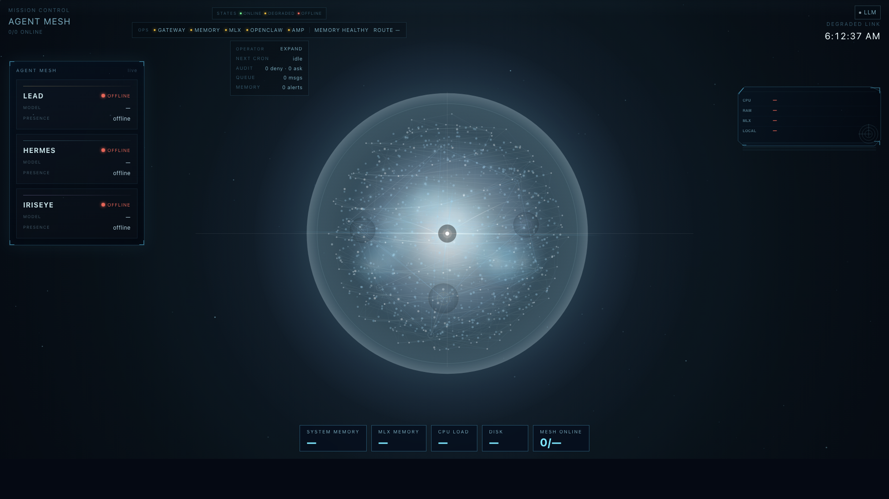
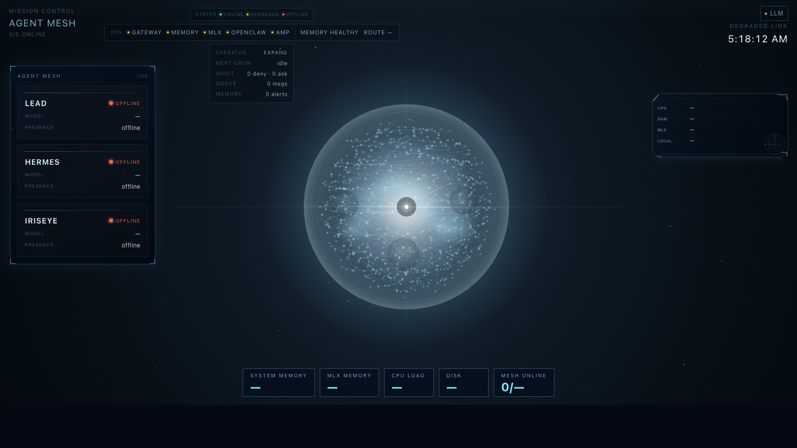

# Agent Mesh Mission Control

Real-time dashboard for multi-agent AI systems — built for the **Claude Code + Hermes + OpenClaw** stack. One command to run. No cloud. No API keys.

   



---

## What it shows

Most local AI setups are invisible. Agents run in separate terminals, routing decisions disappear into logs, memory health is hard to interpret, and operator state gets scattered across tools. This dashboard pulls that into one live surface.

- **Permanent agent dock** — Lead, Hermes, and IrisEye stay pinned with status, model, presence, runtime, and current task
- **Cinematic mesh sphere** — animated agent/service topology with active-node motion, routing emphasis, and memory-aware link states
- **Ops strip + alerts** — live service health, memory mode, route target, and highest-priority operator alert at a glance
- **Operator utility block** — cron, audit, queue, and memory alert counts without leaving the main view
- **System panel** — CPU, RAM, MLX, and local-use telemetry in the canvas HUD
- **Bottom telemetry rail** — quick system totals for memory, MLX load, CPU load, disk, and mesh availability
- **Memory route intelligence** — backend memory summary, cause ranking, and routing impact surfaced directly in the dashboard
- **Clickable summaries** — operator chips and service indicators focus the matching service or agent in the mesh

---

## Design

Premium dark-mode terminal aesthetic with a mesh-first operator layout. No cloud dependency, no tab hunting, no fake glassmorphism.

- **Mesh-first composition** — the sphere is the product center, not a decorative background
- **Permanent operator dock** — agent state stays visible instead of hiding behind modal panels or tabs
- **Responsive HUD clearance** — the sphere respects the top operator stack and side dock instead of overlapping them
- **Unified accent language** — warm gold, cyan, violet, amber, and red are used consistently for identity and state
- **State-aware motion** — node glow, reticles, and memory-path coloring respond to live routing and degradation causes

---

## Quick Start

```bash
git clone https://github.com/iriseye931-ai/mission-control-dashboard
cd mission-control-dashboard
docker-compose up --build
```

- Dashboard: http://localhost:3000
- Backend API: http://localhost:8000
- WebSocket: `ws://localhost:8000/ws`

No config required — the backend polls your local services and shows live status immediately.

---

## Manual Setup

**Backend:**
```bash
cd backend
pip install -r requirements.txt
uvicorn main:app --reload --host 0.0.0.0 --port 8000
```

**Mesh Doctor:**
```bash
cd backend
./venv/bin/python mesh_doctor.py
```
Runs a local-first operational check over Mission Control, Hermes, AI Maestro, cron freshness, routing policy, and stale agents.

**Frontend:**
```bash
cd frontend
npm install
npm run dev
```

---

## Connecting your agents

The backend polls your local services, normalizes operator state, and broadcasts it over WebSocket. Agents and local tools can push structured events straight into the dashboard through the REST API.

### Recommended integration model

Mission Control works best when each tool keeps its own runtime and authentication model:

- `Claude Code` and `Codex` as installed subscription-backed CLIs
- `Hermes` and `OpenClaw` as configured local agent runtimes
- `OpenViking`, `Memory MCP`, and `MLX` as local infrastructure/services

Mission Control does not replace those tools. It turns them into one operator surface.

### Live state the dashboard expects

- agent status and progress events
- service health and telemetry
- memory recall activity and memory monitor logs
- routing decisions and queue depth
- cron/scheduled task freshness
- local system pressure from the host machine

### Current interface highlights



- permanent agent dock for Lead, Hermes, and IrisEye
- cinematic mesh with clickable service and routing focus
- top operator strip for service health, memory mode, and alerts
- memory cause and routing impact surfaced directly in the main view

**From Python (send a direct agent message):**
```python
import httpx

httpx.post("http://localhost:8000/api/agent-messages", json={
    "from_agent": "hermes",
    "to_agent": "atlas",
    "summary": "Memory route degraded",
    "details": "Gateway degraded. Recommend local fallback until Memory MCP recovers.",
    "files": ["backend/main.py"]
})
```

**Via WebSocket (browser / any client):**
```javascript
const ws = new WebSocket("ws://localhost:8000/ws");
ws.onmessage = (e) => console.log(JSON.parse(e.data)); // full mesh state on every update
```

**Direct messaging payload:**
| Field | Type | Use for |
|-------|------|---------|
| `from_agent` | `string` | Source agent/tool |
| `to_agent` | `string` | Target agent/tool |
| `summary` | `string` | Short operator-readable subject |
| `details` | `string` | Optional body text |
| `files` | `string[]` | Optional related file paths |

**REST API:**
```
GET  /api/health        — health check
GET  /api/agents        — active agents + status
GET  /api/status        — full dashboard state snapshot
GET  /api/routing       — current routing summary
GET  /api/system        — CPU, RAM, MLX RAM, PID
GET  /api/logs          — recent log buffer
GET  /api/cron          — Hermes scheduled jobs
GET  /api/memories      — recent memory recalls
GET  /api/memory-events — normalized memory event stream
GET  /api/amp/messages  — AMP messages from AI Maestro
GET  /api/amp/events    — live routing events from bridge logs
GET  /api/agent-messages — direct agent-to-agent message history
POST /api/agent-messages — send a direct agent-to-agent message
POST /api/amp/send      — send AMP message to any agent
```

---

## Stack

| Layer | Tech |
|-------|------|
| Frontend | React 19, Vite, TypeScript, Tailwind CSS, Zustand |
| Backend | FastAPI, uvicorn, WebSockets, Pydantic |
| Inference | MLX (Qwen3.5 35B-A3B 4-bit, Apple Silicon) |
| Deploy | Docker Compose (one command) |

---

## Built for local AI meshes

This dashboard was built alongside the [iriseye](https://github.com/iriseye931-ai/iriseye) local AI mesh, and works with any similar setup:

| Role | Examples |
|------|---------|
| Lead agent | Claude Code (Atlas), any CLI agent |
| Task runner | Hermes, any cron-capable agent |
| File/web agent | OpenClaw / iriseye, browser-use |
| Memory store | OpenViking, mem0 |
| Local LLM | MLX (Apple Silicon), Ollama, llama.cpp |

The backend auto-detects running processes and polls local service endpoints — no instrumentation required to get a working dashboard.

Want the full mesh setup? → [iriseye repo](https://github.com/iriseye931-ai/iriseye)

---

## Routing policy

Mission Control now treats the mesh as `local-first, premium-by-exception`.

- `Hermes` is the default workhorse for routine execution.
- `iriseye` handles interactive file and web tasks.
- `Atlas` is the lead premium role, served by Codex or Claude Code.
- `claude` is the premium backup when available.

Current enforced routing:

```text
routine      -> hermes
specialized  -> iriseye
premium      -> atlas (fallback: claude)
```

Premium capacity should be reserved for planning, ambiguous debugging, tricky refactors, and final review.

---

## Public repo notes

- the README screenshots are captured from the live local dashboard, not static mockups
- the public repo focuses on the dashboard, backend polling, memory/routing state, and operator UI
- local experimental agent wrapper scripts are intentionally not part of the committed dashboard product surface

---

## Hermes local profiles

Hermes is modeled as one local runner with multiple profiles, not as a pile of always-hot models.

- `workhorse`
  `Qwen3.5-35B-A3B-4bit`
  Default local execution profile.

- `sidecar`
  `Qwen2.5-7B-Instruct-4bit`
  Cheap auxiliary profile for summaries, routing, compression, and lightweight helper work.

- `code-specialist`
  `Qwen2.5-Coder-32B-Instruct-4bit`
  Planned on-demand profile for code-heavy implementation and local review.

- `reasoning-specialist`
  `DeepSeek-R1-Distill-Qwen-32B-4bit`
  Planned on-demand profile for harder local reasoning and second-pass debugging/review.

The design goal is simple:

- keep the always-on memory footprint small enough for a 48 GB Apple Silicon machine
- let Hermes handle most task volume locally
- only load heavier specialist profiles when a task actually justifies it
- avoid burning premium capacity on routine work

---

## License

MIT
